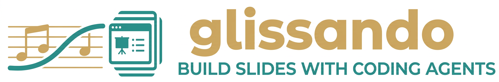

<p align="center">
  
</p>

<p align="center">
  <strong>Slide decks as code, built for AI agents.</strong><br>
  Write TypeScript, get native editable PPTX.
</p>

<p align="center">
  <a href="https://github.com/concertoy/glissando/releases"></a>
  <a href="https://discord.gg/7nBpZ7HHME"></a>
  <a href="LICENSE"></a>
</p>

---

## Getting Started

```bash
git clone https://github.com/concertoy/glissando.git
cd glissando
npm install
claude
```

Then just describe what you want:

```
/slides a 10-slide pitch deck about on-device AI, with diagrams and code examples
/slides-from-latex path/to/arxiv-paper/
/slides-theme a dark theme inspired by Dracula, with purple accents and monospace headings
```

glissando ships with Claude Code skills and planning agents that handle everything — from outlining your narrative to laying out each slide. You provide the topic, it builds the deck.

## Skills

| Skill | Description |
|---|---|
| `/slides` | Create a slide deck from a natural language description |
| `/slides-from-latex` | Convert a LaTeX paper (Overleaf project, arXiv source) into a slide deck |
| `/slides-theme` | Design a new visual theme from a description (colors, fonts, spacing) |
| `/slides-from-pptx` | Reverse-engineer an existing PPTX back into `slides.ts` source code |
| `/slides-check` | Render slides to PNG and diagnose layout, styling, or content issues |
| `/figure-diagram` | Build a diagram with built-in diagramBox + arrow + connector components |
| `/figure-figma` | **Experimental.** Generate a diagram in Figma via MCP plugin |
| `/slides-footer` | Add slide numbering, footer text, and academic citations |
| `/figure` | **Experimental.** AI-generated raster figure (LLM → SVG → PNG) |

## Themes

| Theme | Style | Install |
|---|---|---|
| `claudeDoc` | Warm cream, terracotta accent, serif headings | `./scripts/install-fonts.sh` |
| `basicWhite` | Pure white, Apple blue accent, Helvetica Neue | No install needed |
| `elegantBw` | Monochromatic black/white, Space Grotesk + Inter | `./scripts/install-fonts.sh elegant-bw` |
| `academia` | Navy + gold, scholarly serif | `./scripts/install-fonts.sh academia` |

<sup>**Preview:** `academia` is a new theme — API is stable but visual polish is ongoing.</sup>

See `CLAUDE.md` for the full API reference — layouts, components, callout variants, connectors, emojis, and font presets.

## License

MIT License &copy; 2026 [Tianzhe Chu](https://tianzhechu.com)
